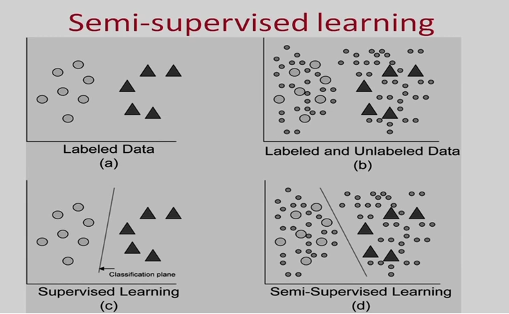
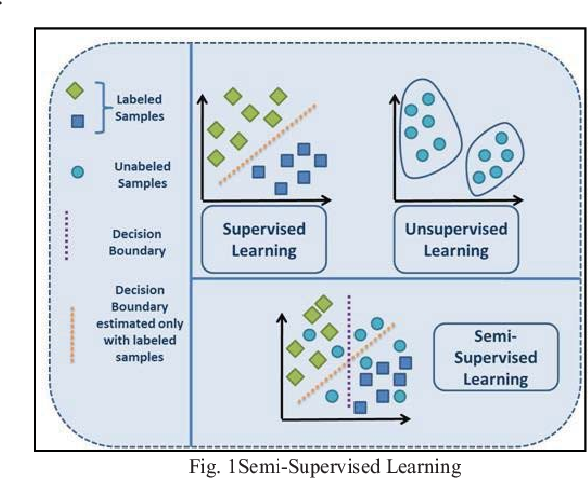

# Basic-Concept-of-Semi-supervised-ML
This repository briefly explains semi-supervised ML and some of its algorithms

## 👋 **MEANING OF SEMI-SUPERVISED ML**
---
Semi-Supervised learning is a type of Machine Learning algorithm that represents the intermediate ground between Supervised and Unsupervised learning algorithms. It uses the combination of labelled and unlabelled datasets during the training period. Even though semi-supervised learning uses both supervised and unsupervised learning, it consists mainly of unlabelled datasets (unsupervised learning). 
Semi-supervised learning is therefore an approach to machine learning that combines a small amount of labelled data with a large amount of unlabelled data during training. Semi-supervised learning falls between unsupervised learning and supervised learning. It is a special instance of weak supervision.

💻 **Where Semi-Supervised ML are widely used**

---
•	Social media platforms
•	Speech recognition
•	Web content classification
•	Text document classification

---
🤓 **Companies that Implement Semisupervised ML**

---
•	Facebook

•	TikTok

**Picture that explains Semi-supervised ML**

The picture below gives a pictorial and further explanation of a semi supervised machine learning 

Author

Richard Mensah

